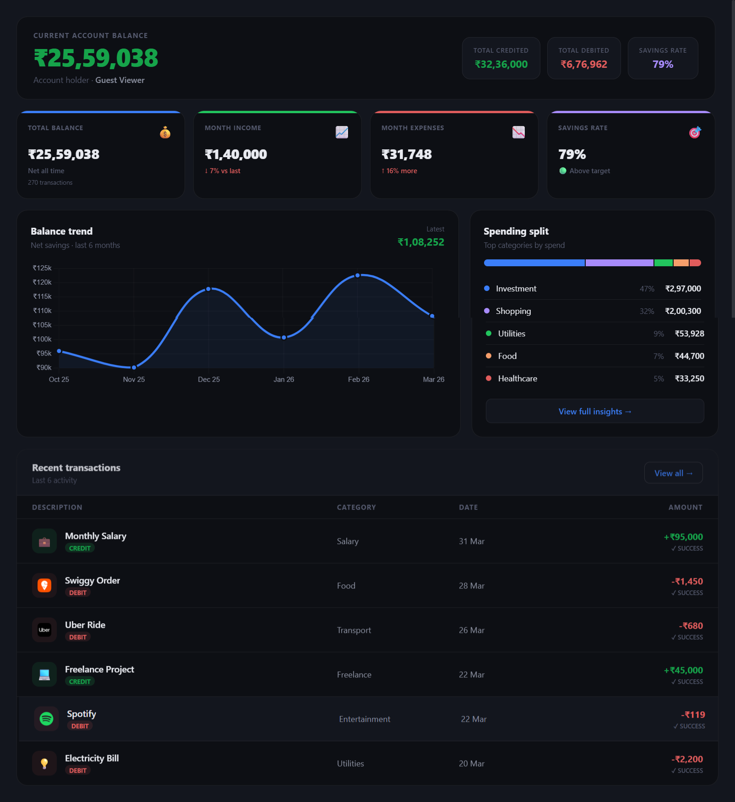
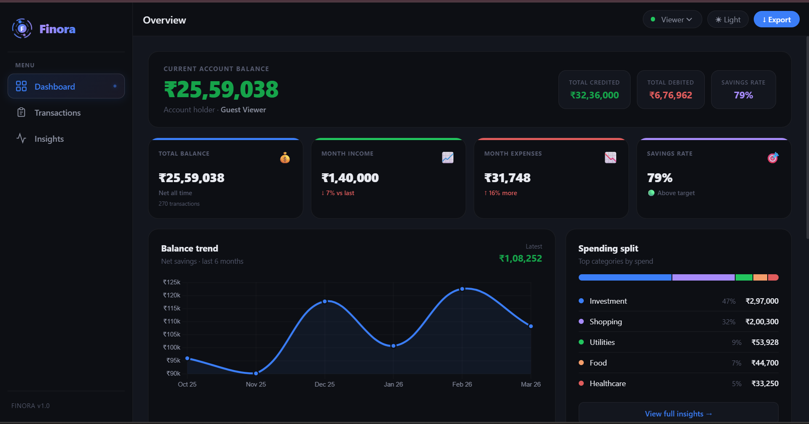
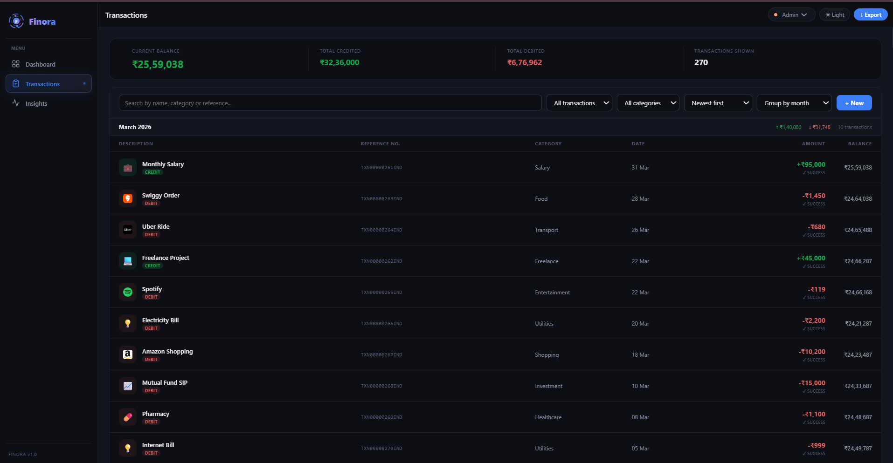
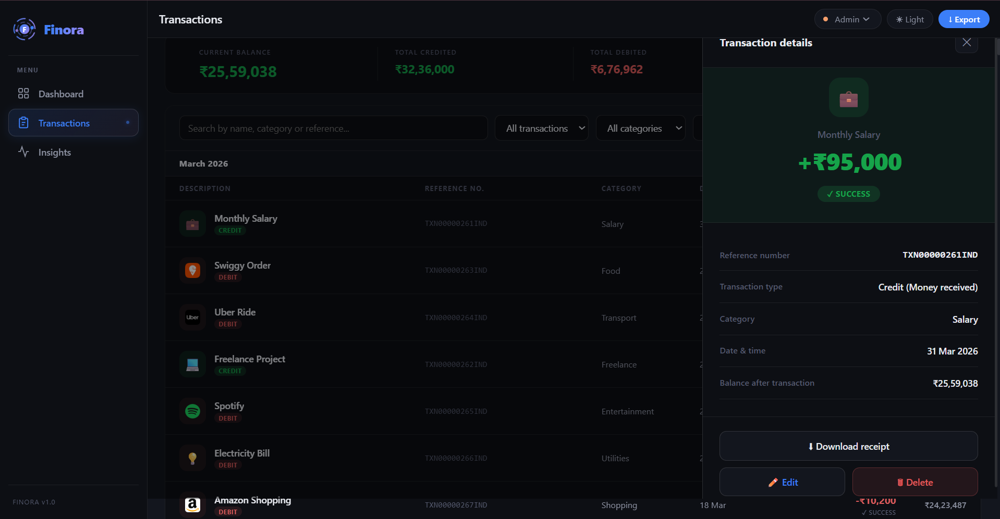
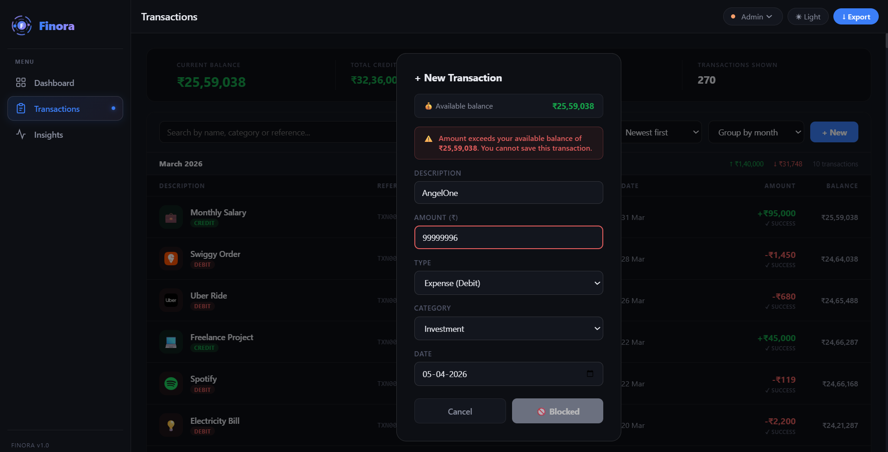
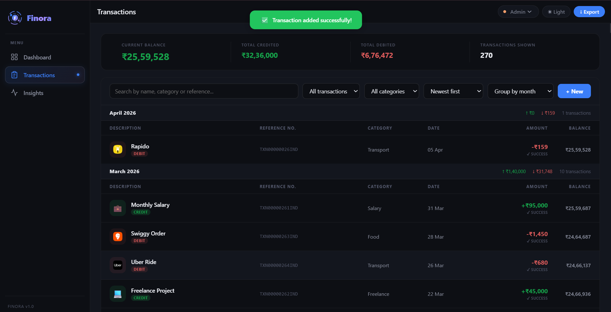
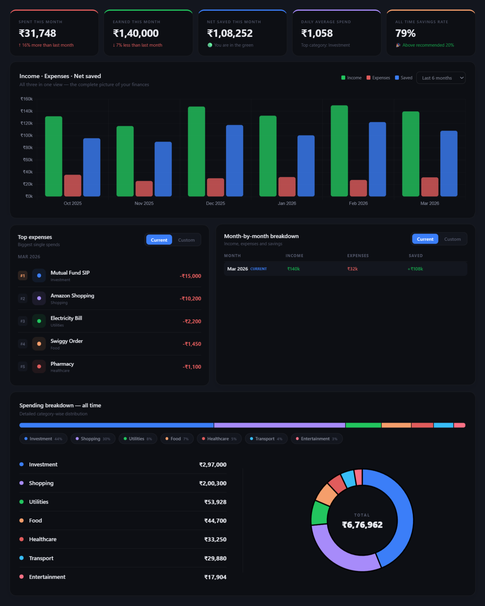

# Finora — Finance Dashboard

A modern, fully interactive personal finance dashboard built with React + Vite. Designed to help users track income, expenses, and spending patterns through a clean, net-banking-inspired interface.

---

## 🔗 Live Demo

[View Live on Vercel] https://finance-dashboard-alpha-ebon.vercel.app/

---

## 📸 Screenshots

### Overview



<br>



<br>

### Transactions



<br>



<br>



<br>



<br>

### Insights



---

## 🧠 Project Overview

Finora is a frontend-only finance dashboard built as part of a frontend developer internship assessment. The goal was to design and develop a clean, interactive UI that allows users to view their financial summary, explore transactions, and understand spending patterns — all without any backend dependency.

The project focuses on frontend architecture, UI design quality, component structure, state management, and overall user experience.

---

## ⚙️ Tech Stack

| Technology | Purpose |
|---|---|
| React 18 | UI component framework |
| Vite | Build tool and dev server |
| Chart.js + react-chartjs-2 | Bar, line, and doughnut charts |
| React Context API + useReducer | Global state management |
| localStorage | Data persistence across sessions |
| Pure inline CSS + CSS Variables | Styling and theming system |

---

## 📁 Project Structure
```
src/
├── main.jsx                  Entry point
├── index.css                 Global styles, CSS variables, dark mode tokens
├── App.jsx                   Root layout — sidebar + topbar + page renderer
│
├── context/
│   └── AppContext.jsx         Global state — transactions, role, theme, page
│
├── data/
│   └── transactions.js        270+ mock transactions + category icon map (Jan 2024 - Apr 2026)
│
├── components/
│   ├── Sidebar.jsx            Desktop sidebar / mobile bottom nav
│   └── Topbar.jsx             Page title, role switcher, dark mode, export
│
└── pages/
    ├── Overview.jsx           Home — KPIs, balance trend, spending split, recent transactions
    ├── Transactions.jsx       Full transaction table — net banking style
    └── Insights.jsx           Analytics — charts, breakdowns, month comparisons
```

---

## 🚀 Getting Started

### Prerequisites

- Node.js v18 or above
- npm

### Installation and Setup
```bash
# Clone the repository
git clone https://github.com/TanishaChauhan07/finance-dashboard.git

# Navigate into the project folder
cd finance-dashboard

# Install dependencies
npm install
npm install chart.js react-chartjs-2

# Start the development server
npm run dev
```

Open your browser and visit `http://localhost:5173`

---

## ✨ Features

### 📊 Overview Page
- Account balance header showing current balance, total credited, total debited, and savings rate — styled like a net banking home screen
- 4 KPI cards for total balance, this month income, this month expenses, and savings rate — each with month-over-month percentage delta and animated count-up on load
- 6-month balance trend line chart with smooth curve and area fill which when clicked naviagtes to the full Insights page
- Spending split panel with a segmented color bar and category breakdown with percentages
- Recent transactions strip in net banking table style with CREDIT/DEBIT badges and hover states — clicking navigates to the full Transactions page

### 💳 Transactions Page
- Account summary strip at the top showing live current balance, total credited, total debited, and filtered transaction count
- Full transaction table modelled after real net banking interfaces
- Running balance column showing exact balance after every transaction calculated in chronological order
- Unique reference number per transaction in the format TXN00000001IND
- CREDIT and DEBIT badges built into the description column — no separate type column
- SUCCESS status shown under every amount
- Slide-in detail drawer — click any row to open a full panel from the right side showing amount, reference number, category, date, balance after transaction, and a receipt download button
- Receipt download generates a properly formatted text file for any transaction
- Search by transaction name, category, or reference number
- Filter by type (credit or debit) and by category
- Sort by newest, oldest, highest amount, or lowest amount
- Group by month or category with subtotals shown per group
- Admin role — full add, edit, delete access with confirmation modal before deletion
- Viewer role — complete read-only experience with all action buttons hidden
- Fully responsive — horizontal scroll on mobile with a simplified card layout

### 📈 Insights Page
- 5 KPI cards with staggered entrance animations and count-up — spent this month, earned this month, net saved this month, daily average spend, and all-time savings rate
- Three-dataset grouped bar chart showing income, expenses, and net saved side by side for every month — with dropdown to switch between last 3, 6, 12 months, or all time
- Top expenses panel with Current and Custom toggle — Current shows latest month automatically, Custom lets the user pick any specific month from a dropdown — results ranked 1 to 5 with category labels
- Month-by-month breakdown table with Current and Custom toggle — Current shows only the latest month, Custom shows last 3, 6, 12 months, or all time — each row shows income, expenses, and net saved
- Full-width spending breakdown panel with segmented color bar, category pills, a detailed list showing dot, name, percentage, and amount on the left side, and a donut chart with total spend in the center and a two-column legend on the right

### 🌙 Dark Mode
- Full dark mode via data-theme attribute on the root element
- Toggled from the topbar — preference saved to localStorage and restored on next visit
- All colors defined as CSS custom properties for instant seamless transitions

### 👤 Role-Based UI
- Admin — can add, edit, and delete transactions via modal form with input validation
- Viewer — read-only mode, all action buttons are hidden from the UI
- Role switched via a dropdown in the topbar — selection saved to localStorage

### 💾 Data Persistence
- All transaction data saved to localStorage and survives page refresh
- Dark mode preference persisted across sessions
- Role selection persisted across sessions

### 📤 Export
- CSV export — downloads all current transactions as a .csv file
- JSON export — downloads all current transactions as a .json file
- Always accessible via the Export button in the topbar

---

## 🎨 Design Decisions

### Styling Approach
Pure inline CSS with CSS custom properties instead of Tailwind or MUI. This gave complete control over every visual detail, enabled a proper dark mode system through CSS variable overrides on the data-theme attribute, and kept the bundle lean with zero styling dependencies.

### State Management
React Context API with useReducer for transactions and useState for role, theme, and page navigation. Redux or Zustand would have been over-engineering for a three-page application — Context kept the architecture simple, readable, and easy to extend.

### Chart Library
Chart.js via react-chartjs-2 was chosen over Recharts for its animation system, grouped bar chart support, and flexible custom tooltip callbacks. The known trade-off is that the canvas element cannot read CSS variables, so chart colors are hardcoded as hex values and do not switch between light and dark themes.

### Net Banking UI Pattern
The Transactions page was intentionally designed to feel like a real internet banking interface — running balance column, reference IDs, CREDIT/DEBIT terminology, slide-in detail drawer, and SUCCESS status badges — so the UI feels immediately familiar to any user who uses online banking.

### Responsive Strategy
Desktop uses a fixed 56px icon sidebar. On mobile below 640px it collapses into a bottom navigation bar using a window resize listener. All CSS grid layouts switch to single column below 768px. Padding, font sizes, and table layouts adjust per screen size. Wide tables get horizontal scroll wrappers on mobile.

---

## 📦 NPM Dependencies
```json
{
  "react": "^18.x",
  "react-dom": "^18.x",
  "chart.js": "^4.x",
  "react-chartjs-2": "^5.x",
  "vite": "^5.x"
}
```

---

## ⚠️ Known Limitations

- Mock data only — no real backend or database integration
- Running balance recalculates if transactions are deleted out of chronological order
- Role switching is a frontend simulation only — no real authentication

These limitations can be addressed in future iterations by integrating a real backend such as Node.js with Express and a database like MongoDB or PostgreSQL for persistent data storage, using a theming-aware charting library like Recharts which supports CSS variables natively, and implementing proper authentication with JWT tokens to replace the frontend-only role simulation with genuine server-side access control.

---

## 👤 Author

Gave my 100% in building this finance dashboard with full dedication as part of the Zorvyn Frontend Internship Assessment,hoping to get accepted and learn from the best people in the future.

---

## 📄 License

This project is submitted for assessment and evaluation purposes only.